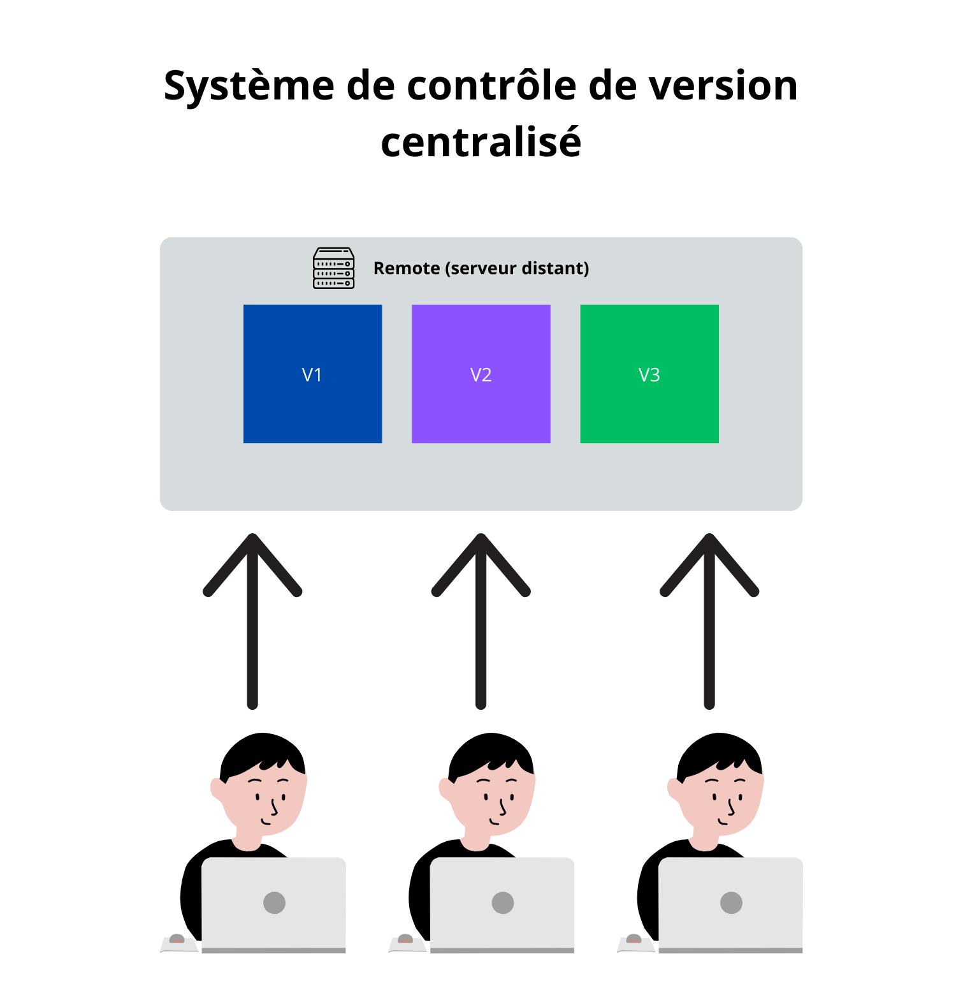
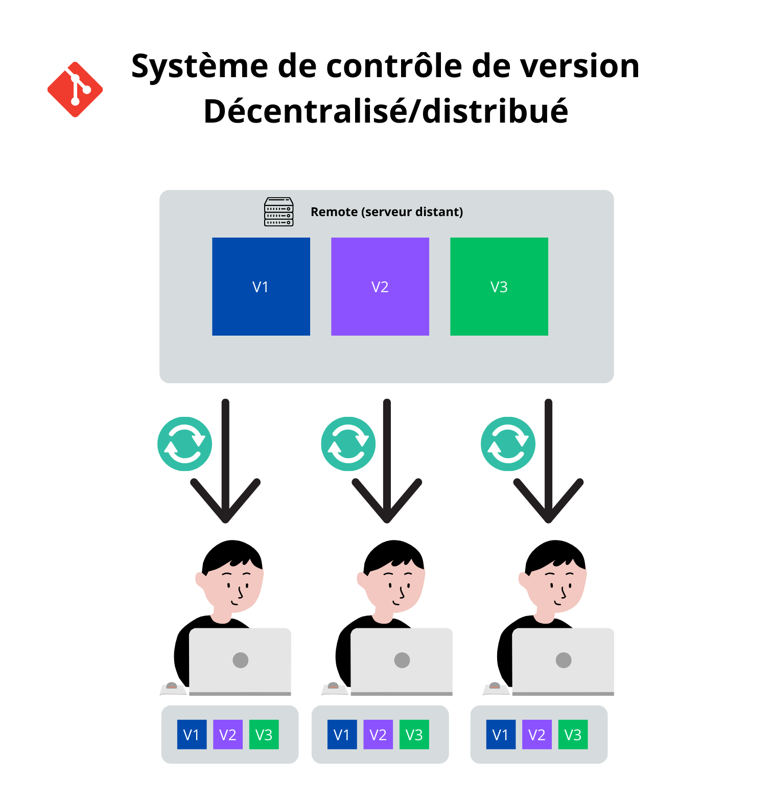

# Types de Systèmes de Contrôle de Version

## Deux Approches Différentes

Il existe deux types de systèmes de contrôle de version, aussi appelés décentralisés/distribués :

### 1. Système Centralisé

Les systèmes centralisés sont aujourd'hui moins utilisés en raison de leurs limitations.

### 2. Système Distribué

## Avantages du Système Distribué

### Copie Complète Locale

- Chaque utilisateur possède une copie complète du dépôt
- Historique complet disponible localement
- Possibilité de travailler sans connexion internet

### Sécurité et Fiabilité

- Pas de point unique de défaillance
- Si le serveur est corrompu, n'importe quelle copie locale peut servir de sauvegarde
- Multiples sauvegardes distribuées

### Flexibilité pour les Développeurs

- Possibilité de faire des essais localement sans impacter les autres
- Travail simultané sur les mêmes fichiers possible
- Synchronisation à la demande avec le serveur central

### Versionnement Efficace

- Chaque version contient l'ensemble des modifications depuis la version précédente
- Historique complet et détaillé
- Fusion (merge) facilitée des modifications

## En Pratique

Les développeurs :

1. Récupèrent une copie complète du dépôt
2. Travaillent localement
3. Synchronisent régulièrement avec le serveur central
4. Peuvent continuer à travailler même en cas de problème serveur
