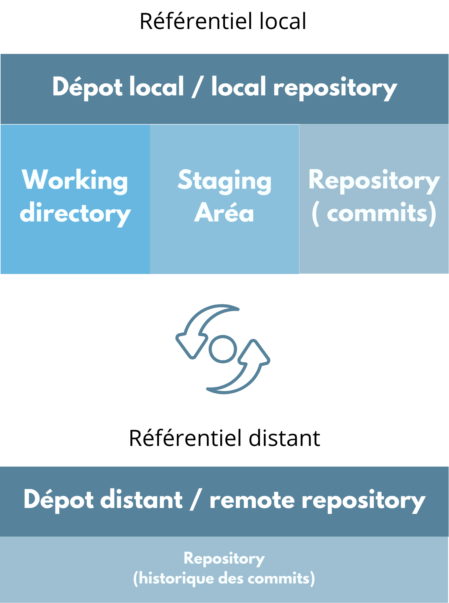
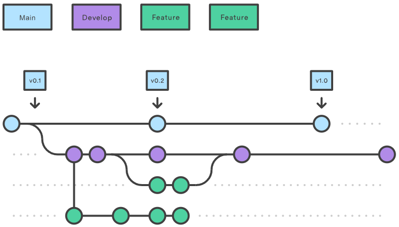

# Structure d'un dépôt Git

Un dépôt Git est composé de trois zones principales :

## Working Directory (Répertoire de travail)

- Zone de travail active sur votre machine
- Contient tous les fichiers du projet
- C'est ici que vous créez, modifiez et supprimez vos fichiers

## Staging Area (Zone d'index)

- Zone temporaire intermédiaire
- Permet de préparer le prochain commit
- Les fichiers sont "indexés" via la commande `git add`
- Permet de sélectionner précisément les modifications à inclure

## Repository (Dépôt)

- Base de données Git locale
- Stocke l'historique complet du projet
- Chaque commit représente un instantané (snapshot) du projet
- Les commits sont liés entre eux de manière chronologique

## Workflow Git

> 💡 **Rappel** : Chaque point sur le graphique représente un commit, c'est-à-dire un instantané du projet à un moment donné.
