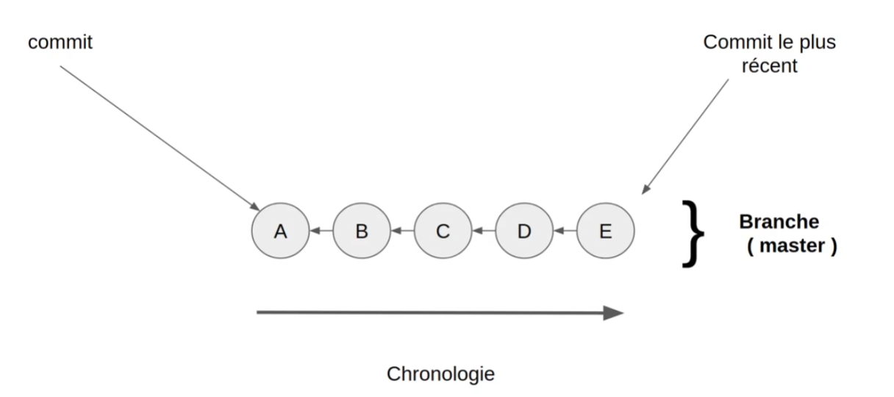
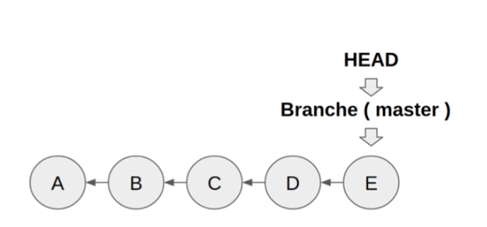
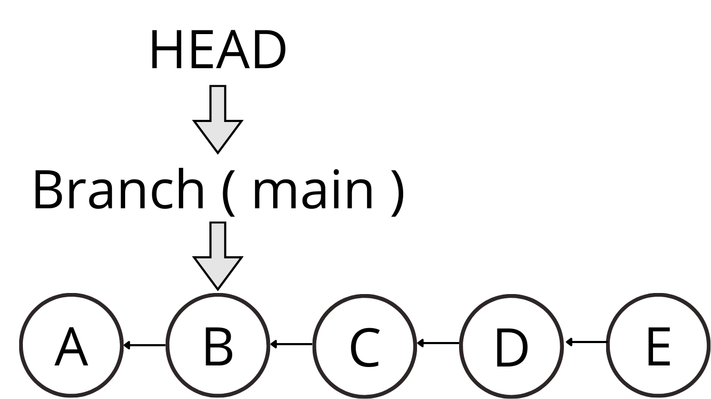
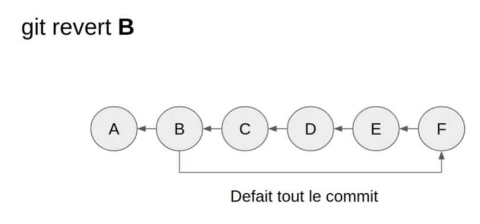
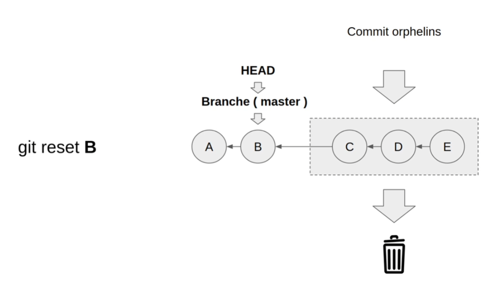

# Les Commits en détail

## Historique et références

Les commits dans Git sont liés entre eux de manière chronologique :

- Chaque commit contient une référence vers son parent
- Cette chaîne de références forme l'historique du projet
- Le dernier commit est appelé "HEAD"



## Navigation dans l'historique

### Le pointeur HEAD

- HEAD est un pointeur qui indique notre position actuelle
- Par défaut, HEAD pointe vers le dernier commit de la branche courante
- On peut déplacer HEAD avec la commande `git checkout`

```bash
# Se déplacer sur un commit spécifique
git checkout hash_commit
```



### Mode détaché (Detached HEAD)

- État où HEAD pointe directement sur un commit et non sur une branche
- Permet d'explorer l'historique sans modifier la branche principale
- Utile pour tester des modifications temporaires
- ⚠️ Les nouveaux commits seront perdus sans création de branche



## Modification des commits

### Modifier le dernier commit (amend)

- ⚠️ Ne jamais modifier un commit déjà publié (push)
- Permet de modifier le message ou le contenu du dernier commit

```bash
# Modifier le message du dernier commit
git commit --amend -m "Nouveau message"

# Ajouter des modifications au dernier commit
git commit --amend --no-edit
```

### Annuler des commits

#### Git revert

- Crée un nouveau commit qui annule les modifications d'un commit précédent
- Préserve l'historique
- Recommandé pour les dépôts publics

```bash
git revert hash_commit_B
```



#### Git reset

- ⚠️ Réécrit l'historique (à éviter sur les dépôts publics)
- Supprime les commits après le point de reset
- Plusieurs modes disponibles :

```bash
# Revenir 3 commits en arrière
git reset HEAD~3

# Revenir à un commit spécifique
git reset hash_commit_B
```



### Modes de reset

1. **--soft**

   - Annule le commit
   - Conserve les modifications dans l'index
   - Prêt pour un nouveau commit

2. **--mixed** (défaut)

   - Annule le commit
   - Retire les modifications de l'index
   - Conserve les modifications dans le working directory

3. **--hard**
   - Annule le commit
   - Supprime toutes les modifications
   - ⚠️ Action destructive et irréversible

> ��� **Conseil** : Pour annuler le dernier commit en local, utilisez :

```bash
git reset HEAD~1
```

> ⚠️ **Important** : Ne jamais modifier l'historique d'un dépôt public avec reset ou amend.
