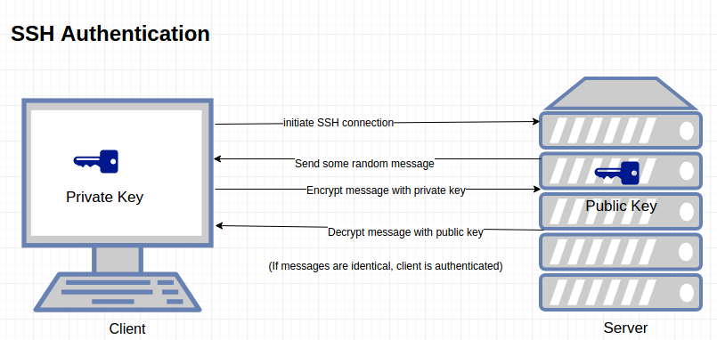
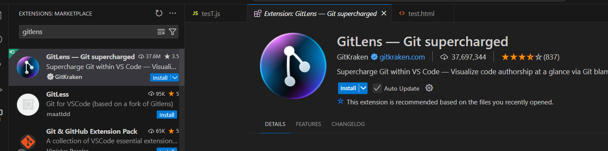
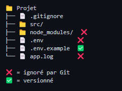
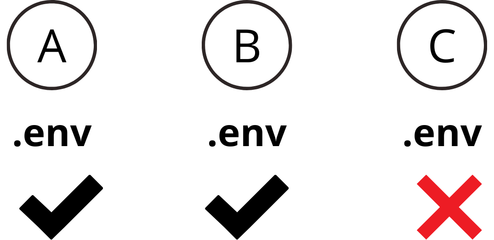
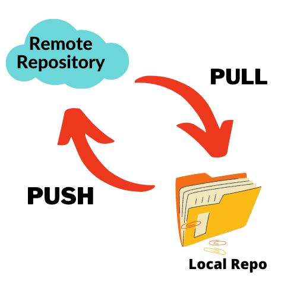
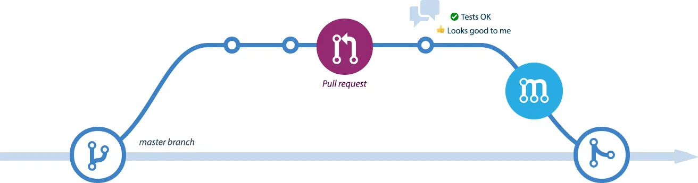

# Git Collaboratif avec GitHub

## GitHub : Une surcouche à Git

### Présentation

- Plateforme d'hébergement de dépôts Git
- Ajoute une dimension collaborative au-dessus de Git
- Gère les autorisations et l'accès aux projets

### Fonctionnalités principales

- Hébergement de dépôts distants
- Issues : Suivi des tâches et bugs
- Pull Requests : Révision de code
- Gestion des droits d'accès

## Synchronisation avec GitHub

### Configurer un dépôt distant

```bash
# Associer le dépôt distant
git remote add origin URL

# Premier push avec configuration du upstream
git push -u origin main
```

#### Détails de git push -u origin main

- `git push` : Envoie les commits locaux vers le dépôt distant
- `-u` (ou --set-upstream) : Configure la branche locale pour suivre la branche distante correspondante (origin/main)
- `origin` : Nom du dépôt distant
- `main` : Nom de la branche à envoyer

### Push de nouvelles branches

```bash
# Créer et basculer sur une nouvelle branche
git checkout -b nouvelle-branche

# Premier push de la nouvelle branche
git push -u origin nouvelle-branche

# Pushs suivants (plus besoin de -u)
git push
```

> 💡 Le flag `-u` n'est nécessaire qu'au premier push d'une branche. Ensuite, Git sait automatiquement où envoyer les modifications.

### Cloner un dépôt existant

```bash
git clone URL
```

> 💡 Après un clone, Git configure automatiquement l'origin

## Sécurisation avec SSH

### Principe de l'authentification SSH

1. Paire de clés :

   - Clé privée (sur votre machine)
   - Clé publique (sur GitHub)

2. Processus d'authentification :
   - GitHub envoie un challenge chiffré
   - Votre machine déchiffre avec la clé privée
   - GitHub vérifie avec la clé publique



> 📖 Guide détaillé dans [connexion-ssh-github.md](../annexes/connexion-ssh-github.md)

## Outils et fichiers spéciaux

### GitLens

- Extension VS Code pour Git
- Visualisation de l'historique
- Blame, historique des fichiers
- Comparaison de versions



### Fichiers spéciaux

#### .gitignore

```bash
# Fichiers à ignorer
*.log
node_modules/
.env
```



#### Données sensibles

- Un fichier supprimé reste dans l'historique
- Attention aux commits de données sensibles
- Utiliser .gitignore AVANT d'ajouter des fichiers sensibles



## Travail collaboratif

### Synchronisation des modifications

#### Git pull

- Récupère ET intègre les modifications distantes
- Peut créer un commit de merge si nécessaire

#### Git push

- Envoie les commits locaux vers le dépôt distant
- Configuration du upstream au premier push



### Gestion des collaborateurs

#### Types d'accès (fonctionnalité GitHub payante)

- Read : Lecture seule
- Triage : Gestion des issues/PR
- Write : Push autorisé
- Maintain : Gestion du repository
- Admin : Accès complet

> 💡 Sur un projet public gratuit, tout le monde peut voir mais seuls les collaborateurs peuvent push

### Pull Requests

#### Principe

- Demande d'intégration de modifications
- Permet la revue de code
- Facilite les discussions



#### Processus de review

1. Examiner les changements
2. Laisser des commentaires
3. Actions possibles :
   - ✅ Approve
   - 💬 Comment
   - ❌ Request changes

### Issues

#### Utilisation

- Suivi des tâches et bugs
- Planification du travail
- Discussion et collaboration


### Protection des branches

#### Règles possibles

- Nombre minimum de reviews
- Tests obligatoires
- Restrictions sur les push directs
- Pull requests obligatoires

> ⚠️ Particulièrement important pour la branche main
