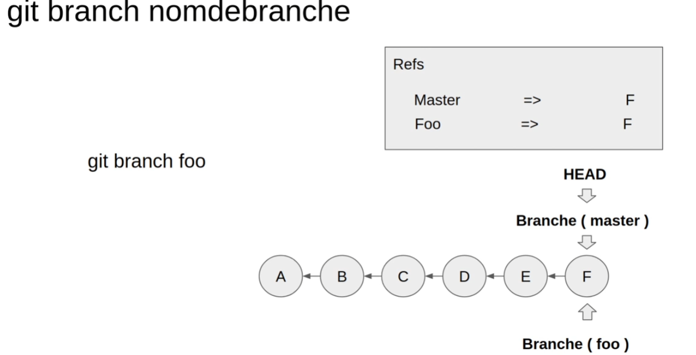
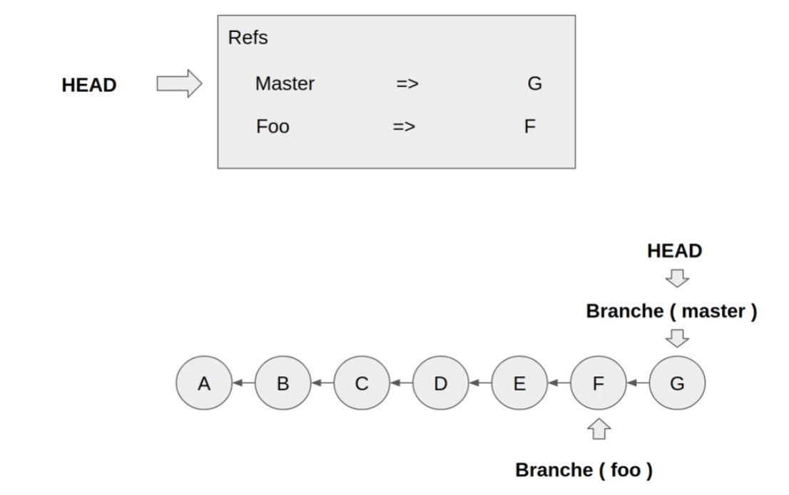
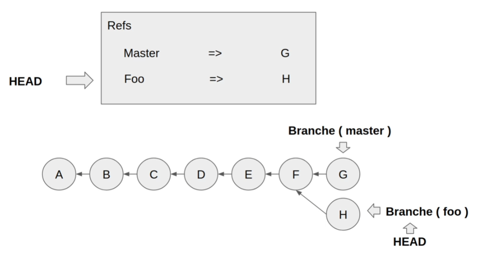
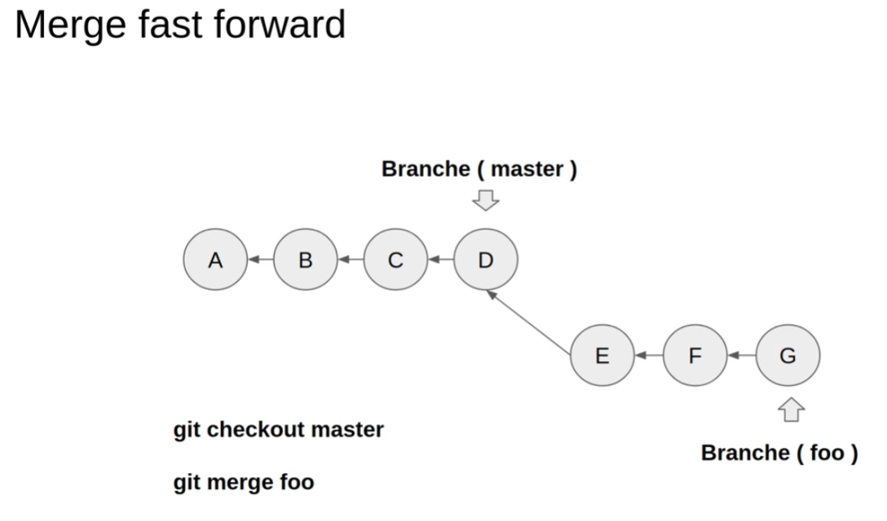
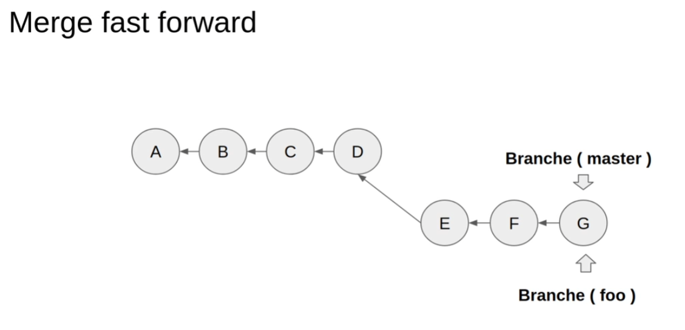
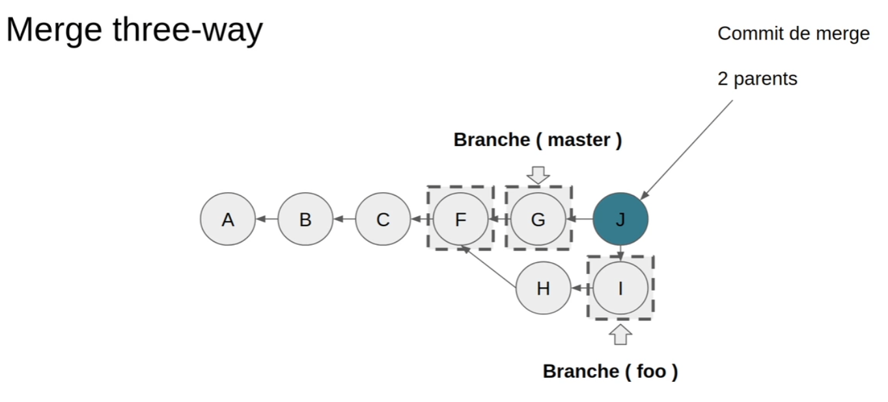
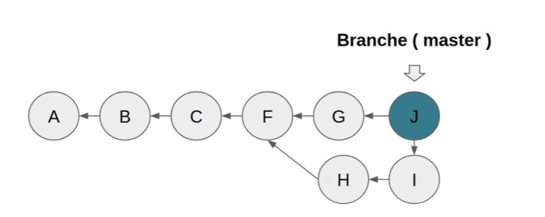
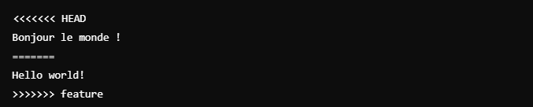
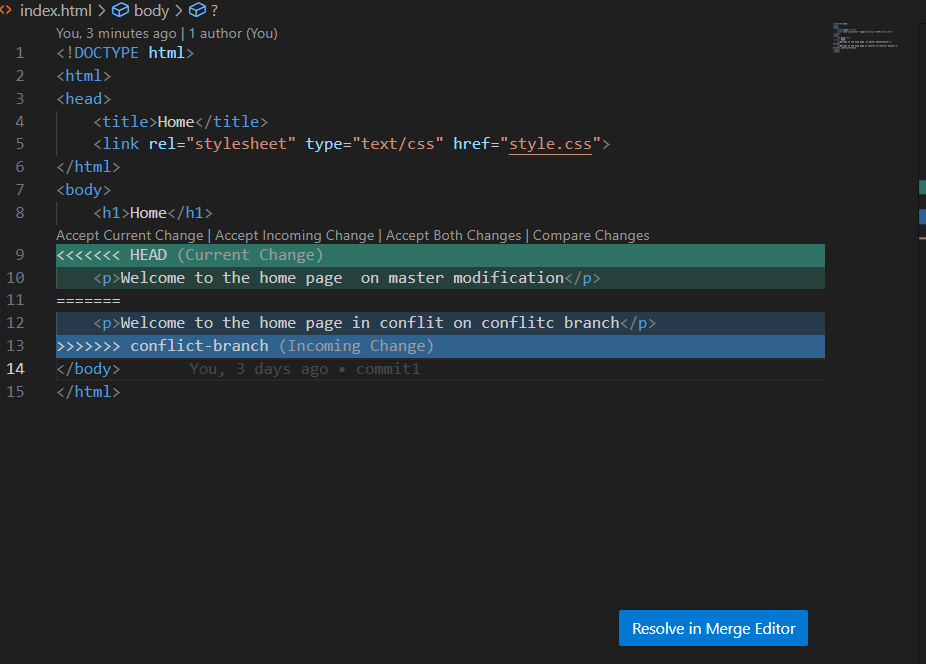

# Gestion des Branches Git

## Introduction aux Branches

### Concept Fondamental

- Mécanisme central de Git pour le développement parallèle
- Permet de travailler sur différentes versions du code simultanément
- Isole les modifications jusqu'à leur validation

> 💡 Les branches sont comme des univers parallèles de votre code. Chaque branche peut évoluer indépendamment, ce qui permet par exemple de développer une nouvelle fonctionnalité sans risquer de perturber le code principal en production.


### Visualisation avec Git Graph

- Extension VS Code complémentaire à GitLens
- Visualisation graphique de l'historique des branches
- Facilite la compréhension des relations entre branches


## Commandes Essentielles

### Gestion des Branches

```bash
# Lister les branches
git branch          # Liste les branches locales
git branch -a       # Liste toutes les branches (locales et distantes)
git branch -v       # Liste les branches avec leur dernier commit

# Créer une nouvelle branche
git branch <nom>

# Changer de branche
git switch <nom>      # Nouvelle commande recommandée
git checkout <nom>    # Ancienne commande

# Créer et basculer sur une nouvelle branche
git switch -c <nom>   # Nouvelle commande recommandée
git checkout -b <nom> # Ancienne commande
```

> 💡 L'étoile (\*) à côté d'une branche indique la branche active (HEAD)

### Fusion de Branches

```bash
# Pour fusionner branchB dans branchA
git switch branchA    # Se positionner sur la branche cible
git merge branchB     # Fusionner la branche source
```

## Théorie des Branches

### Anatomie d'une Branche

- Une branche est un pointeur léger vers un commit spécifique
- HEAD est un pointeur spécial qui indique la branche active
- La création d'une branche ne copie pas le code

> 🔍 Contrairement à ce qu'on pourrait penser, créer une branche ne duplique pas le code. Git crée simplement un nouveau pointeur vers le commit existant, ce qui rend l'opération très légère et rapide.



### Création et Evolution

1. **État Initial**

   - La nouvelle branche pointe vers le même commit que la source
     

2. **Après Modifications**
   - Les branches divergent avec les nouveaux commits
     

## Stratégies de Fusion

### Fast-Forward Merge

- **Conditions** : Pas de divergence entre les branches
- **Processus** : Simple déplacement du pointeur
- **Résultat** : Historique linéaire

> 💡 Le fast-forward est comme rattraper un retard : si vous n'avez fait aucun nouveau commit sur master, Git peut simplement "avancer" master jusqu'au dernier commit de votre branche foo.




### Three-Way Merge

- **Conditions** : Branches divergentes
- **Process** : Utilise trois points de référence
  1. Dernier commit de la branche source (ici commit G de la branche master).
  2. Dernier commit de la branche cible (ici commit I de la branche feature).
  3. Ancêtre commun des deux branches (ici commit F).
- **Résultat** : Nouveau commit de fusion (Commit J)

> ⚠️ Le three-way merge crée toujours un nouveau commit, même si les modifications ne sont pas en conflit. C'est une trace visible de l'intégration des deux branches dans l'historique.




## Gestion des Conflits

### Origine des Conflits

- Modifications simultanées du même fichier
- Changements incompatibles sur les mêmes lignes
- Git ne peut pas décider automatiquement

### Options de Résolution

1. Conserver version branche courante
2. Conserver version branche source
3. Combiner les modifications
4. Créer une version personnalisée

> 🚀 Astuce : Avant de résoudre un conflit, assurez-vous de bien comprendre les modifications de chaque branche. Parfois, la meilleure solution est de discuter avec l'auteur des changements pour prendre la meilleure décision.

### Anatomie d'un Conflit

```text
<<<<<<< HEAD
Version de la branche courante
=======
Version de la branche à fusionner
>>>>>>> feature
```



### Résolution avec VS Code

- Interface graphique intuitive
- Options de résolution en un clic
  - "Accept Current Change" : Garde la version de HEAD.
  - "Accept Incoming Change" : Garde la version de la branche fusionnée.
  - "Accept Both Changes" : Combine les deux versions.



## Bonnes Pratiques

### Nommage des Branches

- Utiliser des noms descriptifs
- Suivre une convention (feature/, hotfix/, etc.)
- Éviter les caractères spéciaux

### Maintenance

- Supprimer les branches fusionnées
- Garder un historique propre
- Documenter les fusions importantes

> 💡 Une bonne gestion des branches est essentielle pour un workflow Git efficace
