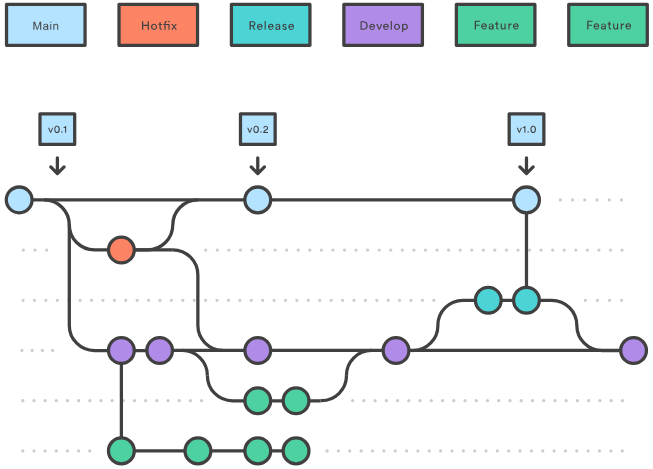
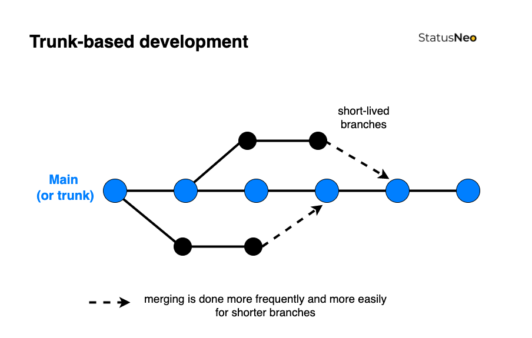
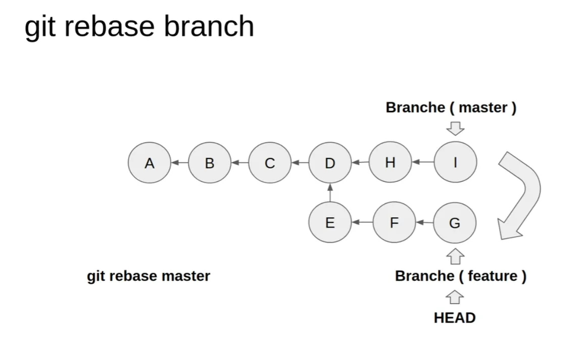
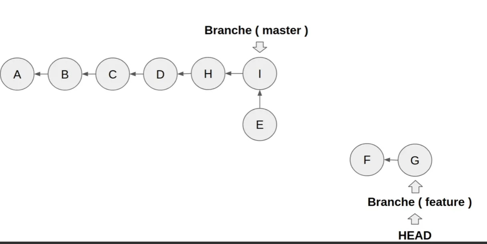
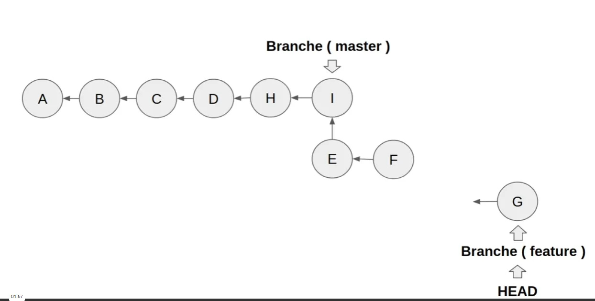
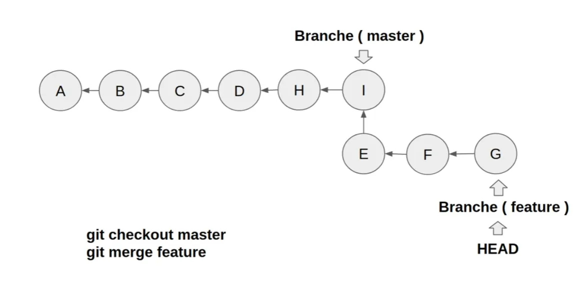

# Fonctionnalités Avancées de Git

## Workflows Git

### GitFlow

GitFlow est un modèle de gestion des branches Git qui définit un ensemble strict de règles pour organiser le développement d'un projet. Ce workflow est particulièrement adapté aux projets avec des cycles de release réguliers.



> 💡 Pour une documentation détaillée sur GitFlow, consultez [le guide Atlassian](https://www.atlassian.com/fr/git/tutorials/comparing-workflows/gitflow-workflow)

### Trunk-Based Development

Le développement basé sur le tronc (Trunk-Based Development) est une approche plus moderne et plus légère que GitFlow, particulièrement adaptée aux pratiques DevOps et à l'intégration continue.

#### Principes clés :

- Une seule branche principale (main/master/trunk)
- Intégration fréquente des modifications
- Branches de fonctionnalités courtes
- Tests automatisés essentiels



> 🔍 Cette approche favorise l'intégration continue en évitant les longues branches de fonctionnalités qui peuvent devenir difficiles à merger.

## Gestion des Versions avec les Tags

### Concept des Tags

Les tags sont des références qui marquent des points spécifiques dans l'historique Git, généralement utilisés pour marquer les versions du logiciel.

#### Types de Tags :

1. **Tags légers** : Simple pointeur vers un commit
2. **Tags annotés** : Contiennent des métadonnées complètes
   - Message de tag
   - Auteur
   - Date
   - Signature possible

### Commandes Essentielles

```bash
# Créer un tag léger
git tag v1.0.0

# Créer un tag annoté
git tag -a v2.0.0 -m "Version stable avec nouvelles fonctionnalités"

# Lister les tags
git tag --list

# Pousser les tags
git push origin v1.0.0     # Push un tag spécifique
git push origin --tags     # Push tous les tags
```

> 💡 Convention de nommage recommandée : vX.Y.Z (Semantic Versioning)
>
> - X : Version majeure (changements incompatibles)
> - Y : Version mineure (nouvelles fonctionnalités compatibles)
> - Z : Patch (corrections de bugs)

## Git Stash : Remisage Temporaire

### Principe du Stash

Le stash permet de mettre de côté des modifications non commitées pour travailler sur autre chose, puis les récupérer plus tard.

```bash
# Remiser les modifications
git stash

# Voir la liste des remisages
git stash list

# Récupérer et supprimer le dernier remisage
git stash pop

# Récupérer sans supprimer
git stash apply
```

> ⚠️ Le stash fonctionne comme une pile : le dernier élément remisé sera le premier récupéré avec `pop`

### Cas d'utilisation courants

- Changement urgent de branche
- Correction de bug prioritaire
- Test rapide d'une autre fonctionnalité

## Git Rebase : Réorganisation de l'Historique

### Concept du Rebase

Le rebase permet de réorganiser l'historique en déplaçant ou combinant une série de commits, créant un historique plus linéaire.



### Processus de Rebase

1. Git identifie les commits à déplacer
2. Applique chaque commit un par un sur la nouvelle base
3. Résolution des conflits si nécessaire
4. Création d'un historique linéaire





> ⚠️ Ne jamais rebase des commits déjà publiés sur un dépôt partagé

## Les Patchs Git

### Introduction aux Patchs

Les patchs sont des fichiers texte contenant des modifications de code, permettant de partager des changements sans passer par un dépôt Git.


### Avantages des Patchs

- Partage de modifications sans accès au dépôt
- Revue de code hors-ligne
- Conservation de l'historique des modifications
- Flexibilité dans l'application des changements

### Utilisation Basique

```bash
# Créer un patch
git format-patch -1 HEAD  # Dernier commit
git format-patch master   # Tous les commits non présents dans master

# Appliquer un patch
git apply mon-patch.patch
```

> 💡 Les patchs sont particulièrement utiles dans les projets open source où tous les contributeurs n'ont pas forcément accès en écriture au dépôt.
